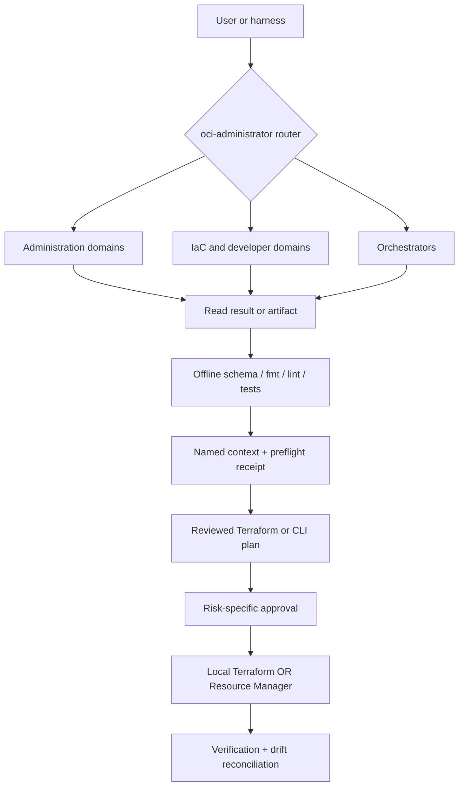

# oci-skills — safe OCI engineering for AI agents

OCI Skills v2 is a tenancy-agnostic engineering assistant for **OCI administration, exact CLI plans, Terraform authoring, and product-platform bundles**. The same safety and routing core installs into Claude Code, Codex/ChatGPT, Gemini CLI, and Antigravity.

It ships no tenancy data, OCIDs, IPs, keys, or credentials. Examples use `<PLACEHOLDER>` tokens resolved from your named context at runtime.

Start with the [five-minute quickstart](docs/QUICKSTART.md), read the [architecture](docs/ARCHITECTURE.md), or inspect the [v2 PRD](docs/product/oci-skills-v2-prd.md).

## What it does

- Safely inspect and administer OCI IAM, security, networking, databases, observability, cost, serverless, OKE, and related control-plane services.
- Generate exact `oci_cli` command plans with read, risk-classified action, verification, rollback, and official sources.
- Scaffold, discover, validate, test, plan, inspect, apply, and destroy OCI Terraform while binding the applied plan to the reviewed bytes and context.
- Compose five private-default platform golden paths as schema-v1 bundles: API + Functions, Container Instances, OKE applications, Queue/Streaming workers, and ADB-backed services.
- Run local Terraform or OCI Resource Manager with one declared state owner—never dual ownership.

Generated product bundles contain platform/IaC, IAM requirements, OpenAPI/build/deploy specs, verification, and runbooks. They intentionally contain no business application logic.

## Skill topology

The router selects fifteen primary domains and two orchestrators:

| Skill | Primary ownership |
|---|---|
| `oci-iam-admin` | Users, groups, policies, compartments, budgets, quotas, tags, limits, named contexts |
| `oci-security-compliance` | Cloud Guard, Vault/KMS, Security Zones, WAF, Audit, CIS/ISO-42001, credentials |
| `oci-observability-db` | Monitoring, Logging, APM, OTel, alarms, notifications, connectors, dashboards |
| `oci-dbm-opsi` | Database Management, Operations Insights, Performance Hub, AWR/ADDM/ASH, DBSNMP |
| `oci-autonomous-db` | ADB lifecycle, private endpoints, wallet, ACL, scale, connectivity, read-only diagnostics |
| `oci-networking-compute` | VCN, subnet, NSG, routing, gateways, load balancers, VM/VNIC/volume lifecycle |
| `oci-oke-admin` | OKE cluster/application operations, kubeconfig, ingress, TLS, OCIR pulls, rollouts |
| `oci-zpr-visibility` | ZPR attributes/policies, protected-resource inventory, flow-log correlation |
| `oci-cost` | Usage/spend, forecasts, budgets, FinOps guardrails |
| `oci-log-analytics` | OCL/LQL queries, sources, parsers, entities, detections, content migration |
| `oci-resource-manager` | Managed Terraform stacks/jobs/logs/state and drift operations |
| `oci-data-safe` | Target registration, assessments, audit, discovery, masking |
| `oci-events-functions` | Functions, Events, ONS, Service Connector Hub, Queue, Streaming, event workers |
| `oci-terraform-authoring` | HCL, provider schema, discovery, local validation/plan/apply/destroy |
| `oci-developer-services` | DevOps, API Gateway, Container Instances, Artifact Registry/OCIR delivery |
| `oci-project` | Project bootstrap/status/deploy/teardown lifecycle orchestration |
| `oci-product-development` | Golden-path intake and `platform-bundle.yaml` composition |

The discoverable `oci-administrator` router sits above them. Each request loads the router, one skill, and only the direct reference needed—progressive disclosure rather than all domain knowledge at once.

Deep OCI Generative AI, in-database SQL/RMAN, specialist OKE day-2, and Fusion application work continue to route to official Oracle skills or Fusion documentation. See [the alignment contract](references/oracle-skills-alignment.md).

## Architecture



Full ownership and lifecycle details are in [docs/ARCHITECTURE.md](docs/ARCHITECTURE.md) and [ADR 0003](docs/adr/0003-iac-ownership-and-approval-model.md).

## Safety model

1. Bind a friendly context to profile, compartment, and region.
2. Run `scripts/oci_preflight.sh -c <COMPARTMENT_OCID>` and verify target names. This creates a short-lived, hash-only `0600` receipt.
3. Read before write and treat `409` as “exists”; do not blindly retry creates.
4. Execute live mutations only through:

   ```bash
   run_action --risk additive|in-place|destructive|credential \
     --compartment <COMPARTMENT_OCID> --description "<ACTION>" -- <COMMAND...>
   ```

5. Destructive and credential automation requires the exact approval ID from the dry-run preview. Force in a production context additionally requires `OCI_SKILLS_BREAK_GLASS=true` and is audited.
6. Dry-run executes nothing. Redaction masks sensitive topology and credentials before output or persistence.
7. Terraform owns durable resources by default. Direct CLI mutation is break-glass and must be reconciled in Terraform.

`run_mutating` remains a deprecated additive compatibility alias for v2 migration. The Claude plugin also includes a conditional prompt-routing reminder and a destructive-command hook. Other harnesses use their native instruction adapters plus the authoritative in-script guard, so the README does not claim Claude hooks exist everywhere.

## Quick examples

Artifact-only Terraform authoring:

```bash
./scripts/oci_tf.sh scaffold ./terraform --name private-api
./scripts/oci_tf.sh validate ./terraform
```

Exact CLI-plan validation:

```bash
python3 ./scripts/oci_cli_help.py --json api-gateway gateway create
python3 ./scripts/oci_cli_lint.py ./cli/command-plan.json
```

Offline platform-bundle generation:

```bash
python3 ./scripts/platform_bundle.py scaffold api-functions ./bundle \
  --name private-api --context dev
python3 ./scripts/platform_bundle.py validate ./bundle/platform-bundle.yaml
```

Read-only administration:

```bash
eval "$(./scripts/oci_context.py use dev)"
./scripts/oci_preflight.sh -c "$OCI_SKILLS_COMPARTMENT"
python3 ./scripts/iam_audit.py | python3 ./scripts/redact.py
./scripts/oci_project.sh status -c "$OCI_SKILLS_COMPARTMENT" --bundle ./bundle/platform-bundle.yaml
```

No example above deploys infrastructure. Plan/apply examples and approval behavior are in the [quickstart](docs/QUICKSTART.md).

## Install

From a clone:

```bash
git clone https://github.com/adibirzu/oci-skills.git
cd oci-skills
make install              # every detected harness
make install-codex        # or one target
make dry-run              # preview copy operations
```

Claude Code plugin:

```text
/plugin marketplace add adibirzu/oci-skills
/plugin install oci-administrator@oci-skills
```

Codex/ChatGPT can import `.codex-plugin/plugin.json`. Gemini uses `harness/gemini/`; Antigravity uses `harness/antigravity/AGENTS.md`. Copy installs include skills, references, scripts, schemas, planning docs, commands, and hooks. Claude activates hooks only when the pack is loaded as a plugin (marketplace or `--plugin-dir`), not from a plain skill copy.

## Requirements

- Bash 3.2+, Python 3.10+, `tar`, `jq`, and the OCI CLI for administration helpers.
- Terraform 1.5+ for authoring/execution; 1.7+ for native `.tftest.hcl` tests.
- A configured OCI profile or supported principal mode only for live reads/plans/actions.
- No OCI credentials for scaffolding, schema validation, routing tests, docs, or bundle generation.

## Quality and release

CI runs Python tests with branch/statement coverage, Bash 3.2 smoke matrices, shell/Python lint, skill validation, routing collision checks, the blinded forward-eval contract, Terraform formatting/validation fixtures, documentation links, and secret/redaction gates. No CI test contacts or mutates a tenancy.

The manifests are prepared as `v2.0.0-rc.1`. Final `v2.0.0` promotion is blocked on the independently recorded fresh-agent gate. Prepare and score a blinded run with `python3 scripts/forward_eval.py`; follow [the evidence workflow](evals/forward/README.md) and status ledger in [docs/plans/oci-skills-v2.md](docs/plans/oci-skills-v2.md).

## Repository map

```text
skills/          canonical discoverable skills + agents/openai.yaml + assets
references/      direct progressive-disclosure knowledge
scripts/         safety, CLI, Terraform, bundle, and read-only helpers
schemas/         platform-bundle schema
tests/           unit, integration, shell smoke, and sanitized fixtures
evals/           routing cases plus blinded fresh-agent prompts and rubric
docs/            PRD, plan, architecture, ADRs, quickstart
harness/         Codex, Gemini, and Antigravity adapters
commands/        legacy Claude slash-entry compatibility
hooks/           Claude-only router reminder + defense-in-depth guard
```

License: MIT.
