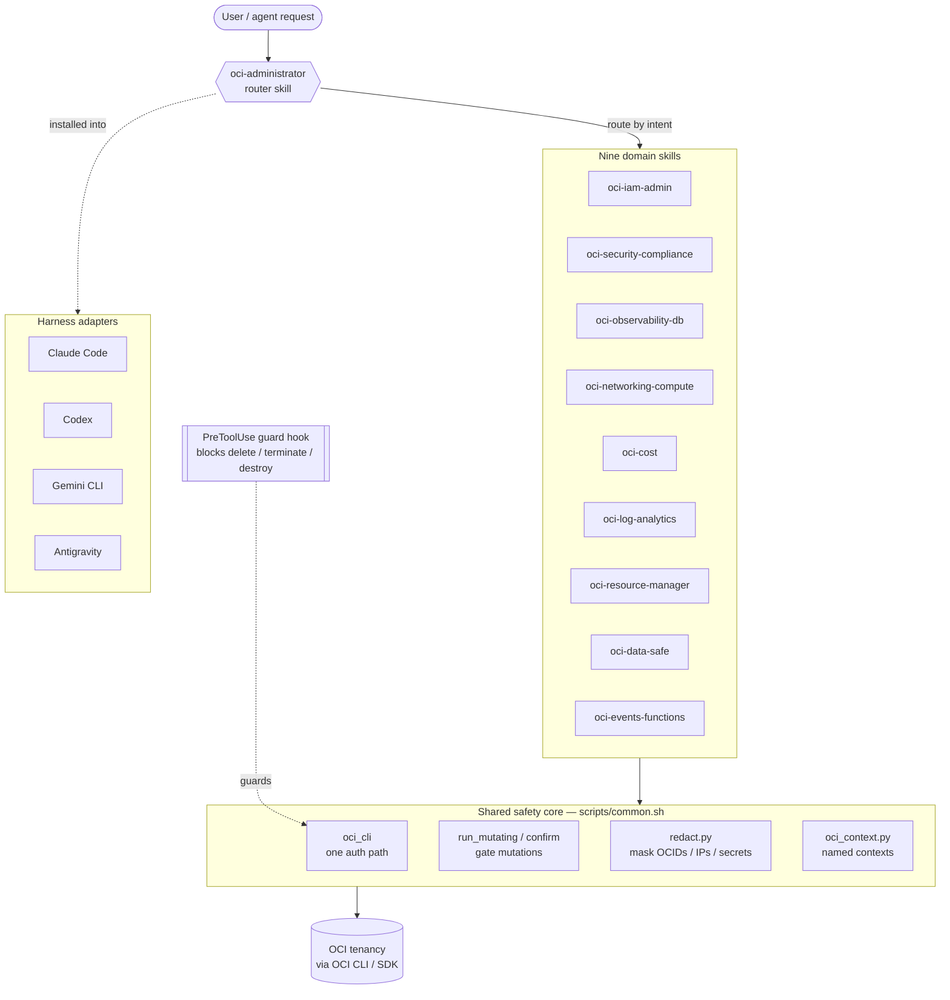

# oci-skills — OCI Administrator skill pack

A tenancy-agnostic **Oracle Cloud Infrastructure (OCI) administration** skill
pack for AI coding agents. One safety-first knowledge core, nine admin domain
skills, packaged for **Claude Code, Codex, Gemini CLI, and Antigravity**.

> Built to be reused in *any* tenancy. It ships **no** OCIDs, IPs, keys, or
> tenancy data — only generic command patterns and `<PLACEHOLDER>` tokens you
> resolve at runtime from your own environment.

**New here? → [docs/QUICKSTART.md](docs/QUICKSTART.md)** — install, bind a named
context, preflight, and run the read-only "what's going on?" loop in five minutes.

## Why

OCI administration knowledge tends to get copy-pasted across scripts: the same
`oci` CLI auth negotiation, the same "check the service limit first", the same
"is the WAF rule in OBSERVE or BLOCK?" gotchas. This pack centralizes those into
one reusable core plus nine domain skills, with a hard rule that nothing
sensitive is ever printed or committed.

## Domains

| Plugin | Covers |
|--------|--------|
| **oci-iam-admin** | Users, groups, dynamic groups, policies (least-privilege review), compartments, budgets, quotas, **service limits**, tags, Identity Domains. |
| **oci-security-compliance** | Cloud Guard, Vault/KMS, Security Zones, WAF, Audit, CIS / ISO-42001 / sovereignty scanning, IAM policy review, secret redaction. |
| **oci-observability-db** | Monitoring & alarms, Logging, Log Analytics, APM (traces/RUM), Notifications, Service Connector Hub, Database Management, Operations Insights, Autonomous DB. |
| **oci-networking-compute** | VCN, subnets, NSGs, route tables, gateways, load balancers, OKE, compute instances, OCIR. |
| **oci-cost** | Cost & usage reporting (Usage API: spend by service/compartment/region/tag), budgets (limit vs actual vs forecast), cost-tracking tags, guardrail recommendations. |
| **oci-log-analytics** | OCI Log Analytics (Logan): the OCL query language, a read-only query helper, sources/parsers/fields/entities/log groups, detections (incl. Sigma→OCL), saved/scheduled searches, dashboards, content migration. |
| **oci-resource-manager** | Resource Manager (managed Terraform): stacks, plan/apply/destroy jobs, job logs/state, drift detection, state import, variables, and schema.yaml stack packaging. |
| **oci-data-safe** | Data Safe: target-database registration (ADB + cloud DB), private endpoints, Security/User Assessment, Activity Auditing, Data Discovery, Data Masking. |
| **oci-events-functions** | Event-driven & serverless: OCI Functions (deploy/invoke/config), Events rules (eventType → FAAS/ONS/STREAMING), Notifications/ONS, Service Connector Hub fan-out, Streaming transport. |
| **oci-project** | **Project lifecycle orchestrator** (above the nine domains): bootstrap/scaffold a project (compartment + scoped IAM + network + budget + tags), project status/health, deploy/release (ORM/OKE), and gated teardown — scoped to one project compartment via a named context. |

> **Scope & related.** This pack is the **default entry point for OCI tenancy
> administration** — broad infrastructure and control-plane work across nine
> domains, gated by the safety core. It is complementary to the official
> [oracle/skills](https://github.com/oracle/skills) collection, which goes *deep*
> on a few capabilities. Catch the request here (tenancy preflight + redaction +
> destructive-op guard), then hand off: **deep OKE day-2** (GVA, Multus,
> troubleshooting) → `oci/oke`; **OCI Generative AI / Enterprise AI** →
> `oci/enterprise-ai`; **inside an Oracle Database** (SQL/PL/SQL, RMAN, AWR/ASH,
> migrations, Data Guard) → `db/`. We own the OCI services *around* the database
> (DBM, OPSI, Data Safe, ADB provisioning). Full routing contract — coverage
> matrix, hand-off rules, shared conventions — in
> [references/oracle-skills-alignment.md](references/oracle-skills-alignment.md).

## Architecture

A request enters through the **router** (`oci-administrator`), is routed by intent
to one of nine **domain skills**, and every CLI call funnels through one shared
**safety core** (`scripts/common.sh`) before it ever reaches the tenancy. The same
core is installed, unchanged, into each agent harness.



**Progressive disclosure keeps it simple:** an agent reads the router, then *one*
domain `SKILL.md`, then that domain's `references/*.md` only if it needs depth — it
never loads all nine domains at once. Each layer is one short file.

## Safety model

Every plugin inherits the same contract (see
[`references/tenancy-safety.md`](references/tenancy-safety.md)):

- **Preflight** — confirm *which* tenancy/compartment before any change
  (`scripts/oci_preflight.sh`), shown by **name**, never raw OCID.
- **Read before write**, idempotent (`409 Conflict` = "already exists").
- **Destructive ops gated** by `confirm` / `run_mutating`; honor
  `OCI_SKILLS_DRY_RUN=true` and `OCI_SKILLS_FORCE=true`.
- **Never emit secrets** — `scripts/redact.py` masks OCIDs, IPs, fingerprints,
  install keys, private-key blocks, and token blobs (used as a CI gate).
- **One auth path** — `oci_cli` in `scripts/common.sh` negotiates config /
  instance / resource / OKE-workload / security-token auth.

## Install

### As a Claude Code plugin (slash commands + safety hook)

```text
/plugin marketplace add adibirzu/oci-skills      # or: /plugin marketplace add ~/dev/oci-skills
/plugin install oci-administrator@oci-skills
```

This gives you the slash commands below plus a PreToolUse hook that blocks
destructive `oci` commands until they are preflighted and confirmed:

| Command | Does |
|---|---|
| `/oci-administrator:context` | Manage named contexts (name → profile + compartment + region). |
| `/oci-administrator:preflight` | Confirm the target tenancy/compartment by name (read-only). |
| `/oci-administrator:audit` | Read-only IAM posture snapshot. |
| `/oci-administrator:cost` | Read-only cost, usage & budget summary. |
| `/oci-administrator:logan` | Read-only Log Analytics (OCL) query with a time window. |
| `/oci-administrator:orm` | Read-only Resource Manager overview (stacks + latest job). |
| `/oci-administrator:datasafe` | Read-only Data Safe overview (targets + assessment). |
| `/oci-administrator:kb` | Search the KB for a known fix. |
| `/oci-administrator:troubleshoot` | KB-first, route to domain, propose a gated fix. |

The copy-install paths below additionally deliver the auto-triggering knowledge
skills and the multi-harness adapters (Codex, Gemini, Antigravity).

### One line (recommended)

Installs into every agent harness it detects (Claude Code, Codex, Gemini CLI,
Antigravity):

```bash
curl -fsSL https://raw.githubusercontent.com/adibirzu/oci-skills/main/bootstrap.sh | bash
```

Pick specific harnesses, or pin a fork/branch:

```bash
curl -fsSL https://raw.githubusercontent.com/adibirzu/oci-skills/main/bootstrap.sh | bash -s -- claude codex
OCI_SKILLS_REF=main curl -fsSL https://raw.githubusercontent.com/adibirzu/oci-skills/main/bootstrap.sh | bash
```

`bootstrap.sh` clones (or fast-forwards) the repo into
`~/.local/share/oci-skills`, then runs the installer. Re-run it any time to
update. Requires `git`.

### From a clone

```bash
git clone https://github.com/adibirzu/oci-skills.git && cd oci-skills

make install               # install into every detected harness
make list                  # show detected harnesses
make install-claude        # or a single harness: -claude / -codex / -gemini / -antigravity
make dry-run               # preview, copy nothing

# equivalently, the installer directly:
./install.sh               # every detected harness
./install.sh claude codex  # pick specific ones
DRY_RUN=true ./install.sh  # preview
```

Install targets (override with env vars — see `install.sh` header):

| Harness | Destination | Adapter |
|---------|-------------|---------|
| Claude Code | `~/.claude/skills/oci-administrator/` | `SKILL.md` |
| Codex | `~/.codex/skills/oci-administrator/` | `harness/codex/agents/openai.yaml` |
| Gemini CLI | `~/.gemini/extensions/oci-skills/` | `harness/gemini/` |
| Antigravity | `~/.antigravity/skills/oci-administrator/` | `harness/antigravity/AGENTS.md` |

## Requirements

- `bash` (3.2+, so the macOS system `/bin/bash` works), plus the
  [OCI CLI](https://docs.oracle.com/iaas/Content/API/SDKDocs/cliinstall.htm) and
  `jq` on PATH for the shell scripts.
- Python 3.10+ and the `oci` SDK (`pip install oci`) for `iam_audit.py`.
- A configured `~/.oci/config` profile, or instance/resource/workload-identity
  auth when running inside OCI.

## Repository layout

```
.claude-plugin/          # Claude Code plugin manifest + marketplace entry
  plugin.json  marketplace.json
SKILL.md                 # Claude Code entrypoint (router)
AGENTS.md                # Codex / Antigravity entrypoint (mirror)
commands/                # Claude Code slash commands (context/preflight/audit/cost/logan/orm/datasafe/project/kb/troubleshoot)
hooks/                   # PreToolUse guard that blocks destructive oci commands
  hooks.json  guard_destructive.py
references/              # domain + safety knowledge (progressive disclosure)
  tenancy-safety.md  agent-safety.md  oci-error-catalog.md
  oracle-docs.md     # verified docs.oracle.com source-of-truth index
  oracle-skills-alignment.md  # routing contract vs the official oracle/skills repo (deep OKE / GenAI / in-DB)
  solution-authoring.md  # Stage 0 design: requirement → guardrailed architecture → blueprint
  project-workflow.md  # oci-project lifecycle index → project-phase{1-4}-*.md
  project-phase1-bootstrap.md  project-phase2-status.md
  project-phase3-deploy.md  project-phase4-teardown.md
  mcp-gateway.md       # the non-official oci-mcp-gateway (optional read surface; not an Oracle product)
  helper-conventions.md  KB.md  named-contexts.md
  credential-management.md
  iam-tenancy.md  security-compliance.md  observability-db.md  networking-compute.md
  cost-management.md  log-analytics.md  resource-manager.md  data-safe.md  events-functions.md
scripts/                # shared core
  common.sh  oci_context.py  oci_preflight.sh  oci_cost.sh  oci_logan.sh  oci_orm.sh  oci_datasafe.sh
  oci_project.sh  oci_cli_help.py  redact.py  iam_audit.py  kb_lookup.py  check_doc_links.py
skills/                  # eleven auto-discoverable skills (router + nine domains + project orchestrator)
  oci-administrator/  oci-iam-admin/  oci-security-compliance/
  oci-observability-db/  oci-networking-compute/  oci-cost/  oci-log-analytics/
  oci-resource-manager/  oci-data-safe/  oci-events-functions/  oci-project/
harness/                # per-harness adapters (codex / gemini / antigravity)
evals/evals.json        # trigger + behavior evals
bootstrap.sh            # one-line remote installer (curl | bash)
install.sh              # multi-harness installer
Makefile                # make install / list / dry-run
```

## Quick start

```bash
# 0. (Optional) register a friendly context so you never paste OCIDs again
./scripts/oci_context.py add dev --profile DEFAULT --region eu-frankfurt-1 \
  --compartment <COMPARTMENT_OCID> --description "sandbox"
eval "$(./scripts/oci_context.py use dev)"          # sets profile/region/compartment

# 1. Confirm you are pointed at the right tenancy (read-only)
./scripts/oci_preflight.sh -c "${OCI_SKILLS_COMPARTMENT:-<COMPARTMENT_OCID>}"

# 2. Read-only IAM posture snapshot
python3 ./scripts/iam_audit.py --profile "${OCI_CLI_PROFILE:-DEFAULT}"

# 3. Look up a known fix before debugging
python3 ./scripts/kb_lookup.py "kubectl unauthorized oke"
```

## Security & contributing

This is a **public** repository. Never add real OCIDs, IPs, fingerprints,
tenancy namespaces, datakeys, or secrets — CI runs `gitleaks` and
`redact.py --check`. See [CONTRIBUTING.md](CONTRIBUTING.md).

## License

[MIT](LICENSE).
