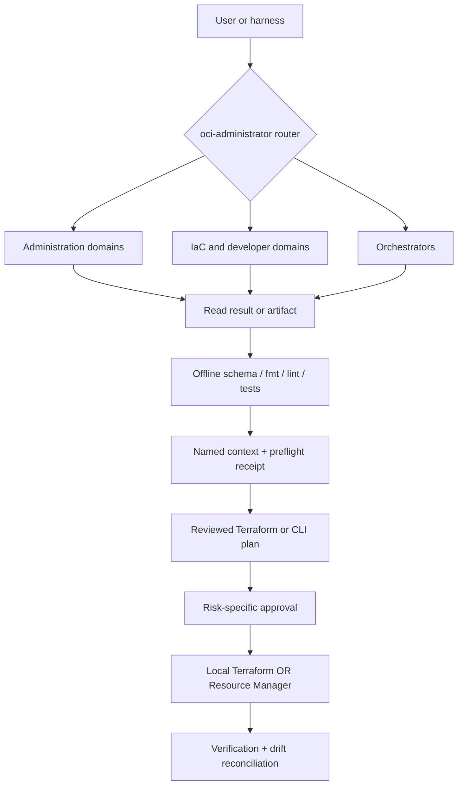

# oci-skills — safe OCI engineering for AI agents

OCI Skills v2 is a tenancy-agnostic engineering assistant for **OCI administration, exact CLI plans, Terraform authoring, product-platform bundles, and OCI-backed application engineering**. The same safety and routing core installs into Claude Code, Codex/ChatGPT, Gemini CLI, and Antigravity.

It ships no tenancy data, OCIDs, IPs, keys, or credentials. Examples use `<PLACEHOLDER>` tokens resolved from your named context at runtime.

Start with the [five-minute quickstart](docs/QUICKSTART.md), pick a skill from the [OCI skill catalog](docs/SKILL_CATALOG.md), read the [architecture](docs/ARCHITECTURE.md), or inspect the [v2 PRD](docs/product/oci-skills-v2-prd.md).

## What it does

- Safely inspect and administer OCI IAM, security, networking, storage, disaster recovery, databases, observability, data platforms, OS patch governance, cost, serverless, OKE, and related control-plane services.
- Generate exact `oci_cli` command plans with read, risk-classified action, verification, rollback, and official sources.
- Scaffold, discover, validate, test, plan, inspect, apply, and destroy OCI Terraform while binding the applied plan to the reviewed bytes and context.
- Compose five private-default platform golden paths as schema-v1 bundles: API + Functions, Container Instances, OKE applications, Queue/Streaming workers, and ADB-backed services.
- Run local Terraform or OCI Resource Manager with one declared state owner—never dual ownership.

Generated product bundles contain platform/IaC, IAM requirements, OpenAPI/build/deploy specs, verification, and runbooks. They intentionally contain no business application logic.

## Skill topology

The 27-skill pack contains a router selecting twenty-one primary domains and five orchestrators:

For a task-first picker, use the [OCI skill catalog](docs/SKILL_CATALOG.md). For an
operator tour of the foundational service domains, read the [core services starter](docs/oci-core-services-starter.md).

<!-- BEGIN OCI SKILLS -->
- **Start here**
  - [**OCI Administrator router**](./skills/oci-administrator) — route broad OCI requests to the right domain skill.
  - [**OCI Project lifecycle**](./skills/oci-project) — bootstrap, inspect health, deploy, or tear down a whole project.
  - [**OCI Product Development**](./skills/oci-product-development) — choose a golden path and compose a platform bundle.
  - [**OCI Application Engineering**](./skills/oci-application-engineering) — review, debug, reuse, and evaluate application code without OCI mutation.
  - [**OCI Landing Zone**](./skills/oci-landing-zone) — assess and design a tenancy foundation.
- **Security and governance**
  - [**OCI IAM Admin**](./skills/oci-iam-admin) — compartments, policies, users, groups, budgets, quotas, tags, and limits.
  - [**OCI Security Compliance**](./skills/oci-security-compliance) — Cloud Guard, Vault, WAF, Vulnerability Scanning, CIS/ISO evidence, and DevSecOps gates.
  - [**OCI ZPR Visibility**](./skills/oci-zpr-visibility) — Zero Trust Packet Routing attributes, policies, protected resources, and flow-log correlation.
  - [**OCI Data Safe**](./skills/oci-data-safe) — database target registration, assessments, audit, discovery, and masking.
- **Infrastructure and access**
  - [**OCI Networking Compute**](./skills/oci-networking-compute) — VCN, NSG, routing, DNS, certificates, load balancers, compute, and attachments.
  - [**OCI OKE Admin**](./skills/oci-oke-admin) — OKE application operations, ingress, TLS, OCIR pulls, and rollout troubleshooting.
  - [**OCI Bastion Access**](./skills/oci-bastion-access) — Bastion sessions, Managed SSH, forwarding, and allowlist diagnosis.
  - [**OCI Storage**](./skills/oci-storage) — Object, File, Block, and Boot storage lifecycle, retention, backup, and replication.
  - [**OCI Disaster Recovery**](./skills/oci-disaster-recovery) — Full Stack DR groups, plans, prechecks, drills, switchovers, and failovers.
  - [**OCI Terraform Authoring**](./skills/oci-terraform-authoring) — HCL authoring, schema lookup, discovery, validate, plan, apply, and destroy.
  - [**OCI Resource Manager**](./skills/oci-resource-manager) — managed Terraform stacks, jobs, logs, state, and drift operations.
  - [**OCI OS Management**](./skills/oci-os-management) — OS Management Hub registration, software sources, Ksplice, update jobs, and patch evidence.
- **Data and databases**
  - [**OCI Autonomous DB**](./skills/oci-autonomous-db) — ADB lifecycle, private endpoints, wallets, ACLs, scaling, and connectivity.
  - [**OCI Database Cloud**](./skills/oci-database-cloud) — Base Database and Exadata lifecycle, backup, patching, and Data Guard.
  - [**OCI DBM OPSI**](./skills/oci-dbm-opsi) — Database Management, Operations Insights, Performance Hub, AWR, ADDM, ASH, and DBSNMP.
  - [**OCI Data Platform**](./skills/oci-data-platform) — Data Integration, Data Flow, Data Catalog, GoldenGate, NoSQL, movement, and replication.
  - [**OCI Log Analytics**](./skills/oci-log-analytics) — OCL/LQL queries, sources, parsers, entities, detections, and content migration.
- **Application delivery**
  - [**OCI Events Functions**](./skills/oci-events-functions) — Functions, Events, ONS, Service Connector Hub, Queue, Streaming, and event workers.
  - [**OCI Developer Services**](./skills/oci-developer-services) — DevOps, API Gateway, Container Instances, Artifact Registry, and OCIR delivery.
- **Observe and optimize**
  - [**OCI Observability DB**](./skills/oci-observability-db) — Monitoring, Logging, APM, OpenTelemetry, alarms, dashboards, and PromQL-to-MQL.
  - [**OCI Cost**](./skills/oci-cost) — usage, spend, forecasts, budgets, and FinOps guardrails.
  - [**OCI Diagramming**](./skills/oci-diagramming) — secure editable Draw.io, Excalidraw, and Mermaid architecture sources with OCI stencil conventions.
<!-- END OCI SKILLS -->

The canonical ownership table remains flat so install tooling and routing tests can treat every skill path consistently:

| Skill | Primary ownership |
|---|---|
| `oci-iam-admin` | Users, groups, policies, compartments, budgets, quotas, tags, limits, named contexts |
| `oci-security-compliance` | OCI posture plus vendor-neutral AppSec/API, supply-chain, agent/plugin/MCP security, compliance evidence, and DevSecOps release gates |
| `oci-observability-db` | Monitoring, Logging, APM, OTel, alarms, PromQL→MQL, Linux/Windows host dashboards |
| `oci-dbm-opsi` | Database Management, Operations Insights, Performance Hub, AWR/ADDM/ASH, DBSNMP |
| `oci-autonomous-db` | ADB lifecycle, private endpoints, wallet, ACL, scale, connectivity, read-only diagnostics |
| `oci-database-cloud` | Base Database and Exadata control-plane lifecycle, backup/restore, patching, Data Guard |
| `oci-storage` | Object, File, Block, and Boot storage lifecycle, retention, backup, and replication |
| `oci-disaster-recovery` | Full Stack DR protection groups, plans, prechecks, drills, switchovers, failovers, reprotection |
| `oci-bastion-access` | Bastion, Managed SSH, fixed/dynamic forwarding, allowlists, plugin diagnosis |
| `oci-networking-compute` | VCN, subnet, NSG, routing, DNS, Traffic Management, Health Checks, Certificates, load balancers, VM/VNIC/attachment lifecycle |
| `oci-oke-admin` | OKE cluster/application operations, kubeconfig, ingress, TLS, OCIR pulls, rollouts |
| `oci-zpr-visibility` | ZPR attributes/policies, protected-resource inventory, flow-log correlation |
| `oci-cost` | Usage/spend, forecasts, budgets, FinOps guardrails |
| `oci-log-analytics` | OCL/LQL queries, sources, parsers, entities, detections, content migration |
| `oci-resource-manager` | Managed Terraform stacks/jobs/logs/state and drift operations |
| `oci-data-safe` | Target registration, assessments, audit, discovery, masking |
| `oci-events-functions` | Functions, Events, ONS, Service Connector Hub, Queue, Streaming, event workers |
| `oci-data-platform` | Data Integration, Data Flow, Data Catalog, GoldenGate, NoSQL, data movement and replication |
| `oci-os-management` | OS Management Hub registration, software sources, Ksplice, update jobs, and patch evidence |
| `oci-terraform-authoring` | HCL, provider schema, discovery, local validation/plan/apply/destroy |
| `oci-developer-services` | DevOps, API Gateway, Container Instances, Artifact Registry/OCIR delivery |
| `oci-project` | Project bootstrap/status/deploy/teardown lifecycle orchestration |
| `oci-product-development` | Golden-path intake and `platform-bundle.yaml` composition |
| `oci-application-engineering` | Application workflow, reuse, review, and adaptive evaluation (no OCI mutation) |
| `oci-landing-zone` | Landing-zone assessment, design, deployment, upgrade, and validation orchestration |
| `oci-diagramming` | OCI architecture diagrams, stencil conventions, structural/security validation, and visual-QA workflow |

`oci-application-engineering` can optionally use a locally configured MultiLLM gateway for model comparison, adaptive cheap-first routing, Fusion synthesis, and sanitized cost/latency traces. It is not enabled or required by this pack: ask for the user's choice, keep restricted code local unless separately approved, and continue normally when the gateway is absent.

When a user chooses MultiLLM, use its optional `claude-multillm` or
`codex-multillm` launcher. In the agent session select `llm_adaptive` for
cheap-first work or `llm_fusion` for a panel-and-synthesis result; check
`llm_model_catalog` before choosing aliases. The setup and direct API example
are in the [MultiLLM guide](https://github.com/adibirzu/multillm#use-fusion-from-claude-code-or-codex).

## Development without unnecessary gates

Offline development is intentionally frictionless: source code, tests,
documentation, local validation, review, and bundle scaffolding proceed without
OCI credentials, a named context, a preflight receipt, or exact CLI help. The
pack applies tenancy checks, action approval, and rollback requirements when a
request actually reads an ambiguously scoped tenancy or changes live OCI
resources.

The discoverable `oci-administrator` router sits above them. Each request loads the router, one skill, and only the direct reference needed—progressive disclosure rather than all domain knowledge at once.

Deep OCI Generative AI, local Functions workstation deployment/troubleshooting,
OCI IoT Platform, in-database SQL/RMAN, specialist OKE day-2, and Fusion
application work route to current official Oracle skills or Fusion documentation.
See [the alignment contract](references/oracle-skills-alignment.md).

## Architecture



Full ownership and lifecycle details are in [docs/ARCHITECTURE.md](docs/ARCHITECTURE.md) and [ADR 0003](docs/adr/0003-iac-ownership-and-approval-model.md).

## Product contracts and readiness

The consolidated release contains **27 skills, 52 requirements, 40 detailed
PRDs, 37 contracts, and 30 journeys**. These inventories are validated offline
and copied into every supported harness.

REQ-13 through REQ-52 add versioned application evidence, deterministic
workflow evaluation, the 27-skill capability catalog, routing precedence,
evidence envelopes, architecture traceability, distribution/redaction/release
contracts, compatibility policy, user journeys, dependency and impact graphs,
verification/provenance registries, an install manifest, safety cases, a release
state machine, migration readiness, schema evolution, accountability,
retention, parity, recovery, architecture invariants, documentation freshness,
release attestation, maintenance policy, change-set manifests, fail-closed
exceptions and waiver expiry, dependency integrity, deterministic output,
performance budgets, network isolation, validated restore, reviewed rollback,
and end-of-life policy. Validate the complete product definition offline:

~~~bash
python3 scripts/product_contracts.py validate
python3 scripts/product_contracts.py report
~~~

The report executes no gate and cannot self-certify the independent fresh-agent
release evidence. It emits only counts, release state, and contract/install
digests.

## Safety model

1. Bind a friendly context to profile, compartment, and region.
2. Run `scripts/oci_preflight.sh -c <COMPARTMENT_OCID>` and verify target names. This creates a short-lived, hash-only `0600` receipt.
3. Read before write and treat `409` as “exists”; do not blindly retry creates.
4. Execute live mutations only through:

   ```bash
   run_action --risk additive|in-place|destructive|credential \
     --compartment <COMPARTMENT_OCID> --description "<ACTION>" -- <COMMAND...>
   ```

5. Destructive and credential automation requires the exact approval ID from the dry-run preview. Force in a production context additionally requires `OCI_SKILLS_BREAK_GLASS=true` and is audited.
6. Dry-run executes nothing. Redaction masks sensitive topology and credentials before output or persistence.
7. Terraform owns durable resources by default. Direct CLI mutation is break-glass and must be reconciled in Terraform.

`run_mutating` remains a deprecated additive compatibility alias for v2 migration. The Claude plugin also includes a conditional router reminder, a model-initiated skill-chain guard, and a destructive-command hook. Other harnesses use their native instruction adapters plus the authoritative in-script guard, so the README does not claim Claude hooks exist everywhere.

## Quick examples

Artifact-only Terraform authoring:

```bash
./scripts/oci_tf.sh scaffold ./terraform --name private-api
./scripts/oci_tf.sh validate ./terraform
```

Exact CLI-plan validation:

```bash
python3 ./scripts/oci_cli_help.py --json api-gateway gateway create
python3 ./scripts/oci_cli_lint.py ./cli/command-plan.json
```

Offline platform-bundle generation:

```bash
python3 ./scripts/platform_bundle.py scaffold api-functions ./bundle \
  --name private-api --context dev
python3 ./scripts/platform_bundle.py validate ./bundle/platform-bundle.yaml
```

Read-only administration:

```bash
eval "$(./scripts/oci_context.py use dev)"
./scripts/oci_preflight.sh -c "$OCI_SKILLS_COMPARTMENT"
python3 ./scripts/iam_audit.py | python3 ./scripts/redact.py
./scripts/oci_project.sh status -c "$OCI_SKILLS_COMPARTMENT" --bundle ./bundle/platform-bundle.yaml
```

No example above deploys infrastructure. Plan/apply examples and approval behavior are in the [quickstart](docs/QUICKSTART.md).

## Install

### Plugin install — Claude Code

The recommended public catalog is the adibirzu LLM marketplace:

```text
/plugin marketplace add adibirzu/adibirzu-plugins
/plugin install oci-administrator@adibirzu-plugins
/reload-plugins
```

You can also install from this repository's smaller project-owned catalog. It
includes OCI Administrator and complementary agent plugins; see the
[catalog-scope contract](docs/ARCHITECTURE.md#compatibility-and-distribution-plane):

```text
/plugin marketplace add adibirzu/oci-skills
/plugin install oci-administrator@oci-skills
/reload-plugins
```

The default is **User scope**. For a repository-managed **Project scope** install, use the plugin manager UI or:

```bash
claude plugin install oci-administrator@adibirzu-plugins --scope project
```

Refresh an existing marketplace installation with:

```text
/plugin marketplace update adibirzu-plugins
/plugin update oci-administrator@adibirzu-plugins
/reload-plugins
```

### Skill / copy install — all harnesses

```bash
git clone https://github.com/adibirzu/oci-skills.git
cd oci-skills
./install.sh --list
DRY_RUN=true ./install.sh
./install.sh claude
./install.sh codex
./install.sh gemini
./install.sh antigravity
```

Temporarily turn off a copy-installed pack without deleting it, then start a new agent session so skill discovery refreshes. Run this from the clone or from the installed bundle directory:

```bash
./install.sh --disable codex
# Test without OCI Skills.
./install.sh --enable codex
```

The installer moves the bundle from the harness's `skills/` or `extensions/` directory to its sibling `disabled/` directory and restores it on `--enable`; it never changes OCI resources or bypasses the pack's safety controls. Disable Claude marketplace plugins through Claude's plugin manager, because this copy-installer does not own plugin installs.

`make install`, `make install-codex`, and `make dry-run` provide equivalent shortcuts. Upgrade a clone with `git pull --ff-only`, then rerun the selected installer. A skill / copy install does not activate Claude plugin hooks; use the plugin install for commands and hooks. Codex/ChatGPT can also import `.codex-plugin/plugin.json`; Gemini and Antigravity use the adapters under `harness/`. Installation and validation are offline and do not contact an OCI tenancy.

## Requirements

- Bash 3.2+, Python 3.10+, `tar`, `jq`, and the OCI CLI for administration helpers.
- Terraform 1.5+ for authoring/execution; 1.7+ for native `.tftest.hcl` tests.
- The `jsonschema` package (`pip install jsonschema`) to validate platform bundles against `schemas/platform-bundle.schema.json` via `scripts/platform_bundle.py validate`.
- A configured OCI profile or supported principal mode only for live reads/plans/actions.
- No OCI credentials for scaffolding, schema validation, routing tests, docs, or bundle generation.

## Quality and release

CI runs Python tests with branch/statement coverage, Bash 3.2 smoke matrices, shell/Python lint, skill validation, routing collision checks, the blinded forward-eval contract, Terraform formatting/validation fixtures, documentation links, and secret/redaction gates. No CI test contacts or mutates a tenancy.

The manifests are prepared as `v2.0.0-rc.3`. Final `v2.0.0` promotion is blocked on the independently recorded fresh-agent gate. Prepare and score a blinded run with `python3 scripts/forward_eval.py`; follow [the evidence workflow](evals/forward/README.md) and status ledger in [docs/plans/oci-skills-v2.md](docs/plans/oci-skills-v2.md).

## Repository map

```text
skills/          canonical discoverable skills + agents/openai.yaml + assets
references/      direct progressive-disclosure knowledge
scripts/         safety, CLI, Terraform, bundle, and read-only helpers
schemas/         platform-bundle schema
tests/           unit, integration, shell smoke, and sanitized fixtures
evals/           routing cases plus blinded fresh-agent prompts and rubric
docs/            PRD, plan, architecture, ADRs, quickstart
harness/         Codex, Gemini, and Antigravity adapters
commands/        legacy Claude slash-entry compatibility
hooks/           Claude-only router, skill-chain, and destructive guards
```

License: MIT.
